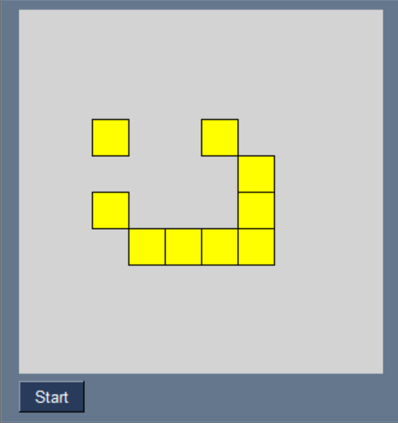

# GameOfLife

Simple App to simulate [Conways Game of Life](https://en.wikipedia.org/wiki/Conway%27s_Game_of_Life) using Python 3.10 with PySimpleGUI 4.57.0

## GUI
* Currently only supports start / stop

## Ideas

* Slider for simulation speed
* load / save function + menu
* predefined pattern placement, select from menu + click to place
* game settings for resizing the field and toggle border behaviour 