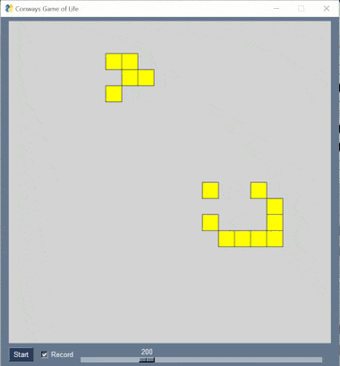

# GameOfLife

Application to simulate [Conways Game of Life](https://en.wikipedia.org/wiki/Conway%27s_Game_of_Life) using Python 3.10 with PySimpleGUI 4.57.0

## GUI
* Start/Stop Simulation
* Record frames on/off: If enabled, screenshots will be stored unter ./records/

## Tests

See [Github Actions](https://github.com/to5ta/GameOfLife/actions/workflows/main.yml) for more details about the tests that are executed on each commit.

## Ideas

&#x2611; ~~Slider for simulation speed~~  
&#x2611; ~~Render image sequences from the simulation~~  
&#x2610; Load / save function + menu  
&#x2610; Predefined pattern placement, select from menu + click to place  
&#x2610; Game settings for resizing the field and toggle border behaviour  
&#x2610; Step forwards / backwards using memento Pattern   
